  

  
  
  
  

---

###  Sobre mim

*  Graduando em **Engenharia de Software** no Centro Universitário de Goiás (2023 - 2026).
*  Atuo como **Desenvolvedor Fullstack**, com foco na construção de APIs REST robustas e integrações de sistemas.
*  Valorizo **Código Limpo, Princípios SOLID, POO** e a arquitetura de **Microsserviços**.
*  Explorando o universo da Inteligência Artificial aplicada, incluindo ferramentas como Spring AI e LangChain.
*  Entusiasta de ambientes Linux (Ubuntu) e automação de processos utilizando n8n e scripts em Python/JavaScript.
*  Atualmente aprofundando conhecimentos no ecossistema **Java (Spring Boot)** e práticas DevOps/Cloud na Azure.

---

### 🛠️ Tecnologias e Ferramentas

**Back-end & Banco de Dados**
 

**Front-end & Mobile**
 

**DevOps, Automação & Cloud**
 

